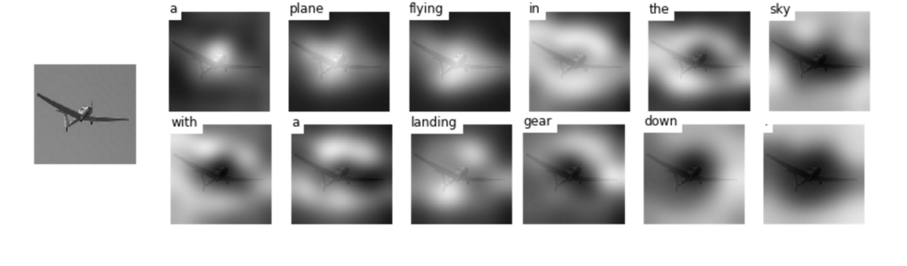

# Show, Attend and Tell 
<b> Update (December 2, 2016)</b> TensorFlow implementation of [Show, Attend and Tell: Neural Image Caption Generation with Visual Attention](http://arxiv.org/abs/1502.03044) which introduces an attention based image caption generator. The model changes its attention to the relevant part of the image while it generates each word.

<br/>



<br/>


## References

Author's theano code: https://github.com/kelvinxu/arctic-captions 

<b>The tensorflow implementation I refer to strongly : https://github.com/yunjey/show-attend-and-tell
(I followed the code of this implementation and changed Tensorflow r1.4 from Tensorflow r0.12.)
</b>

<br/>

## My Experiment Environment

MacBook Pro (Retina, 15-inch, Mid 2015)
(I tried to train using only cpu.)

** In case of MS COCO dataset, the training set is too huge.
** In mac os, the limit of swap memory is approximately 50GB.
** So, I reduce MS COCO train, val, and test set to one-third. 


## Getting Started

### Prerequisites

First, clone this repo and [pycocoevalcap](https://github.com/tylin/coco-caption.git) in same directory.

```bash
$ git clone https://github.com/leejk526/show-attend-and-tell.git
$ git clone https://github.com/tylin/coco-caption.git
```

This code is written in Python2.7 and requires [TensorFlow](https://www.tensorflow.org/versions/r0.11/get_started/os_setup.html#anaconda-installation). In addition, you need to install a few more packages to process [MSCOCO data set](http://mscoco.org/home/). I have provided a script to download the <i>MSCOCO image dataset</i> and [VGGNet19 model](http://www.vlfeat.org/matconvnet/pretrained/). Downloading the data may take several hours depending on the network speed. Run commands below then the images will be downloaded in `image/` directory and <i>VGGNet19 model</i> will be downloaded in `data/` directory.

```bash
$ cd show-attend-and-tell-tensorflow
$ pip install -r requirements.txt
$ chmod +x ./download.sh
$ ./download.sh
```


For feeding the image to the <i>VGGNet</i>, you should resize the <i>MSCOCO image dataset</i> to the fixed size of 224x224. Run command below then resized images will be stored in `image/train2014_resized/` and `image/val2014_resized/` directory.

```bash
$ python resize.py
```

Before training the model, you have to preprocess the <i>MSCOCO caption dataset</i>.
To generate caption dataset and image feature vectors, run command below.

```bash
$ python prepro.py
```
<br>

### Train the model 

To train the image captioning model, run command below. 

```bash
$ python train.py
```
<br>

### (optional) Tensorboard visualization

I have provided a tensorboard visualization for real-time debugging.
Open the new terminal, run command below and open `http://localhost:6005/` into your web browser.

```bash
$ tensorboard --logdir='./log' --port=6005 
```
<br>

### Evaluate the model 

To generate captions, visualize attention weights and evaluate the model, please see `evaluate_model.ipynb`.


<br/>

### Loss graph in Tensorboard


6 epoches

### Validation data

##### (1) Generated caption: A table with a plate of food and cup of coffee .


### Test data

##### (1) Generated caption: A group of people sitting around a table with wine glasses .

